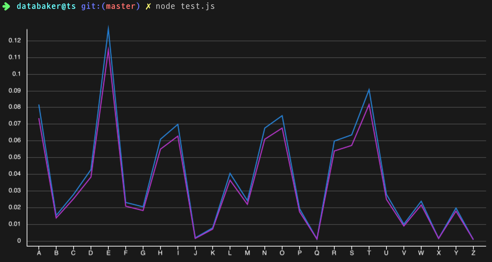

# Data Baker

Data analyze and Plot on Node.js

## Installation

```bash
npm install databaker --save
```

And write code like below:

(sourcefile: [data.csv](./test/stubs/data.csv))

```js
const { LineChart, readCsvFile } = require("databaker")

async function main() {
  const datas = await readCsvFile("./data.csv")

  new LineChart().draw(datas.map(d => d.letter), [
    datas.map(d => +d.frequency),
    datas.map(d => +d.frequency * 0.9),
  ]).show()
}

main()
```

If [iTerm2](https://www.iterm2.com/) is used, the output is as follows:



Awesome!

## Documents

wip

### Data Reader

#### Csv Reader

### Chart

#### Bar Chart
#### Line Chart

## License

MIT
